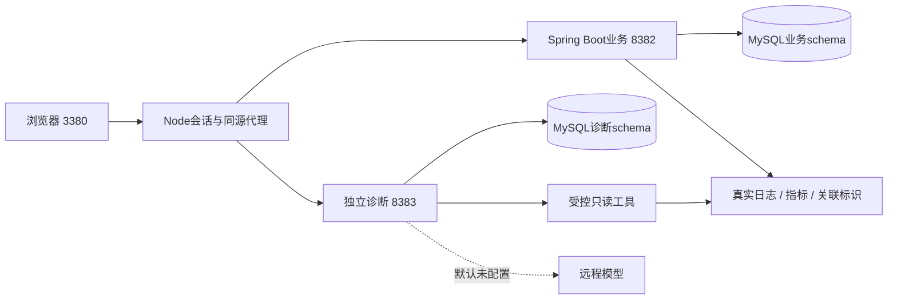

# 架构与设计取舍

普通预约先对资源状态取共享锁，再对目标时段取排他锁；资源管理操作取排他锁。保持资源在先、时段在后的顺序，同一时段的取消与FIFO补位一起提交。幂等记录用于相同请求重放，不替代不同请求间的并发锁。

Outbox和业务同事务提交；消费者有领取租约和失败退避。通知以event_id唯一约束避免重复效果。通知已提交但事件确认失败仍可能重试，不能把至少一次投递包装成exactly-once。

诊断任务保存证据、阶段、预算和检查点。领取身份与租约限制旧执行者写回；取消阻止后续调用，已发出的请求在超时边界结束。工具不提供任意SQL、Shell或演练控制接口，日志是数据而不是授权。

程序可检查引用存在性、范围、格式和事实定位，但不能自动保证模型因果正确。历史上既修复了证据未送达、上下文重复等工程问题，也观察到模型在正确引用下扩大因果范围；两者分别评价。

工作台会话在内存中，重启需登录；业务和任务数据持久化。两个schema共享同一MySQL实例，不宣称物理隔离或跨机器容灾。源码容器配置旨在本地复现，不作为生产部署方案。
